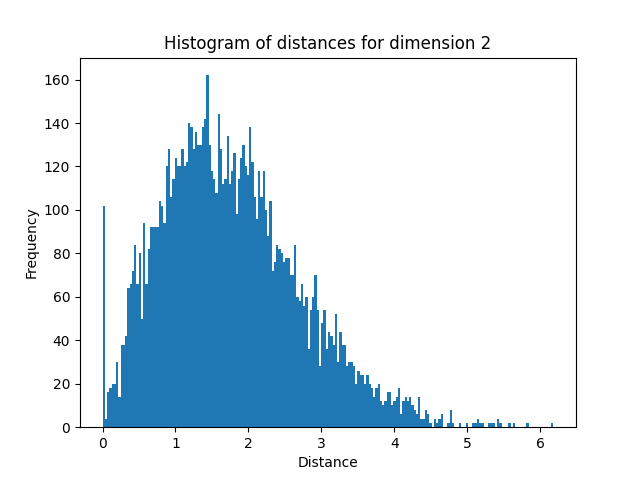
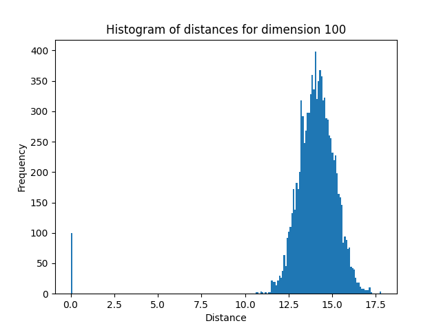
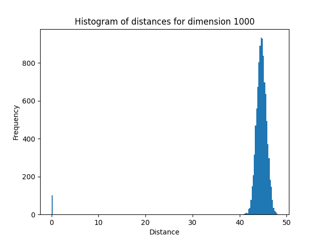

# 数据科学基础第一次作业

## 实验概述

本次作业通过一系列实验探索维度灾难、数据降维及情绪分类问题。我们将从标准正态分布中采样不同维度的数据来探讨维度灾难的现象，并使用 PCA、LDA 和 t-SNE 对脑电信号的微分熵特征进行降维，最终使用 SVM 和 KNN 模型对情绪分类进行建模。

## 实验1：维度灾难

维度灾难是指在高维空间中，数据点之间的距离会发生一些不自然的变化，例如距离过于集中等。

### 实验结果

这部分代码请见 [src/distance.py](src/distance.py)

我分别在 2 维、100 维、1000 维和 10000 维空间中采样，并绘制了距离值的直方图。随着维度的增加，数据点之间的距离逐渐集中在较大的值附近，体现了高维空间中距离趋于一致的现象。

*图 1：2 维空间中的距离分布*

*图 2：100 维空间中的距离分布*

*图 3：1000 维空间中的距离分布*

*图 4：10000 维空间中的距离分布*

(我发现我画出的图的距离区间和老师所给的参考图不太一样，但是我感觉我的程序应该没有问题)

### 讨论

通过实验我们可以观察到，随着维度的增加，数据点之间的距离分布越来越集中，这验证了高维空间中的距离逐渐趋同的现象。维度灾难的一个常见问题是，这种距离的集中会使得基于距离的算法在高维空间中的效果不如低维空间。

---

## 实验 2 ：数据降维

脑电信号的数据维度高达 310 维，因此我们使用三种降维方法：PCA、LDA 和 t-SNE，将数据降至 2 维，并对降维后的数据进行可视化。

### 实验 1 ：对单个被试的数据降维

实验 1 和实验 2 的代码在 [src/reduction.py](src/reduction.py) 中。

我选取了第一个被试的数据，并分别使用 PCA、LDA 和 t-SNE 进行了降维处理。

*图 5：PCA 对单个被试的数据降维结果*

*图 6：LDA 对单个被试的数据降维结果*

*图 7：t-SNE 对单个被试的数据降维结果*

### 实验 2 ：对所有被试的数据降维

我将所有被试的数据结合在一起，进行降维操作。结果如下：

*图 8：PCA 对所有被试的数据降维结果*

*图 9：LDA 对所有被试的数据降维结果*

*图 10：t-SNE 对所有被试的数据降维结果*

### 讨论

从可视化结果可以看到，PCA 和 LDA 在不同情绪类别的区分上有明显的效果，但 t-SNE 能更好地分离不同情绪的样本。t-SNE 尤其适用于非线性数据结构，因此它在这个实验中效果更好。

---

## 实验 3 ：情绪分类

这部分代码在 [src/model.py](src/model.py) 中。

在本实验中，我们使用 SVM 和 KNN 模型分别对每个被试的数据进行分类。我们将训练集和测试集划分好，并分别训练三个 SVM 模型和三个 KNN 模型进行被试依赖的情绪分类。训练过程只使用每个被试自己的数据。

### 实验结果

我对三个被试分别使用 SVM 和 KNN 进行了分类，结果如下：

| 被试编号 | SVM 准确率 | KNN 准确率 |
|---------|------------|------------|
| 被试 1  | 67\%       | 61\%       |
| 被试 2  | 71\%       | 64\%       |
| 被试 3  | 64\%       | 53\%       |

*表 1：SVM 与 KNN 在不同被试数据上的分类准确率*

### 讨论

从实验结果来看，SVM 在三个被试中的表现普遍优于 KNN，且分类准确率较为稳定。例如，被试 1 的 SVM 准确率为 67%，而 KNN 仅为 61%。被试 2 的结果更为显著，SVM 达到了 71% 的准确率，而 KNN 为 64%。被试 3 的表现相对较弱，SVM 为 64%，KNN 则下降到了 53%。

SVM 在大多数情况下表现得更为稳定，这可能是因为 SVM 在处理高维数据时更能找到决策边界，尤其适合数据较为线性分割的情况。而 KNN 的性能在一定程度上受到 K 值的选择影响，且对局部数据结构较为敏感。对于被试 3 来说，KNN 的分类准确率相较于其他被试更低，可能是因为该被试的数据分布更加复杂，导致邻近样本的标签差异较大，使得 KNN 难以准确分类。

总的来说，SVM 在这次情绪分类任务中表现较好，尤其是在数据较为线性分割时。而 KNN 在某些情况下表现不如预期，受限于其邻域特性和对高维数据的不敏感。

---

## 总结

本次实验探讨了高维空间中的维度灾难问题，通过 PCA、LDA 和 t-SNE 三种方法对脑电信号数据进行了降维，并使用 SVM 和 KNN 模型对情绪进行了分类。通过实验结果，我观察到降维方法和分类模型在不同数据上的表现差异，并对各自的优缺点进行了讨论。
