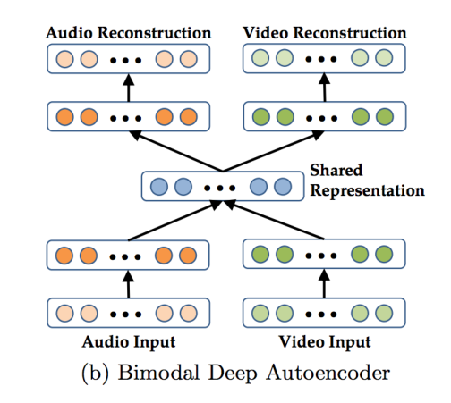

# 数据科学基础第四次作业实验报告

## 实验概述

这次实验是实现脑电信号和眼动信号的多模态融合， 并进行情绪识别。 我使用了特征级融合、决策级融合和 BDAE 三种方式来实现多模态融合。

## 实验细节

### 训练框架

这部分代码在 [src/emotion_recognition.py](src/emotion_recognition.py) 中， 是在之前实验的训练框架的基础上修改的。

### 数据加载

这部分代码在 [src/data_loader.py](src/data_loader.py) 中， 是在之前实验中的 data loader 的基础上修改的。它加载脑电数据和眼动数据。

### 模型结构

+ 特征级融合

这部分代码在 [src/feature_level_fusion_transformer.py](src/feature_level_fusion_transformer.py)

这里我是直接把特征向量进行了拼接再丢给 transformer. 具体而言， 我先对脑电信号和眼动信号各自用一个特征提取器提取特征， 然后将特征进行向量拼接，再进行一下输入维度转换， 然后丢给 transformer 并输出。

+ 决策级融合

这部分代码在 [src/decision_level_fusion_transformer.py](src/decision_level_fusion_transformer.py)

这里我是对脑电信号和眼动信号各自用了一个 transformer 来训练，然后把它们的输出拼接再丢给一个线性层输出最终结果。 

+ BDAE

这部分代码在 [src/bimodal_deep_autoencoder.py](src/bimodal_deep_autoencoder.py.py)

模型结构就是按照下面这张图实现的:



也就是脑电数据和眼动数据分别用一个 encoder，编码之后的特征计算出 shared representation, 然后再分别用一个 decoder 解码出样本。 这样我们用解码的样本可以计算重建误差， 用 shared representation 可以学到用于分类的特征。

### 超参数设置

这里的超参数设置我还是通过网格搜索来确定， 这部分代码在 [src/emotion_recognition.py](src/emotion_recognition.py) 的 `grid_search` 函数中。很奇怪的一点是我网格搜索了很多参数还是没有找到准确率很高的一组参数。 我最终采用的参数分别是:

+ 特征级融合

```
'learning_rate': 0.0001
'hidden_size': 64
'latent_dim': 64
'output_size': 3
'num_heads': 4
'num_layers': 2
'lr_scheduler_type': 'StepLR'
```

+ 决策级融合

```
'learning_rate': 0.0001
'hidden_size': 64
'latent_dim': 64
'output_size': 3
'num_heads': 4
'num_layers': 2
'lr_scheduler_type': 'StepLR'
```

+ BDAE

```
'learning_rate': 0.01
'hidden_size': 128
'latent_dim': 64
'output_size': 3
'num_heads': 4
'num_layers': 2
'lr_scheduler_type': 'StepLR'
```

## 实验结果

| 模型 | 平均准确率 | 标准差 |
|-----------|---------------|---------|
| Feature Level Fusion  | 0.51 | 0.12 |
| Decision Level Fusion | 0.46 |0.07 |
| BDAE  | 0.45 | 0.09 |

## 实验结果分析

对于三种多模态融合的方案， 它们的共同点是希望在不同角度上得到两种模态的联合表示， 不同点是进行融合的阶段不同。 特征级融合是在提取特征之后立刻融合， 决策级融合是将特征输入到模型中、得出输出之后再融合， 而 BDAE 是用融合数据进行编码后的特征。

这里我三种方案都没有训练达到很高的模型准确率。 模型准确率最高的是特征级融合，最低的是 BDAE。 我最初猜测是 learning rate 设置得不对， 因此添加了 learning rate scheduler, 但模型识别准确率并没有因此提高。 我猜测可能是网络结构设计有一些问题，如果有更多时间， 我会去尝试画一下训练集和测试集 loss 的变化曲线再针对性调整一下模型结构。